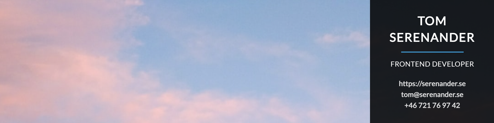

# LinkedIn Cover Image

## Description

This is a project which fetches a free, random image (based on theme word) from the site [Unsplash](https://unsplash.com/) and displays an image which could be set as the header of your LinkedIn profile.

The purpose is to show your contact information very clearly at the top of the page.

 

## Technologies

-   HTML
-   CSS
-   JavaScript
-   React

## Live link

The cover image can be seen in
[my LinkedIn profile](https://www.linkedin.com/in/tom-serenander/)

Please feel free to visit!
